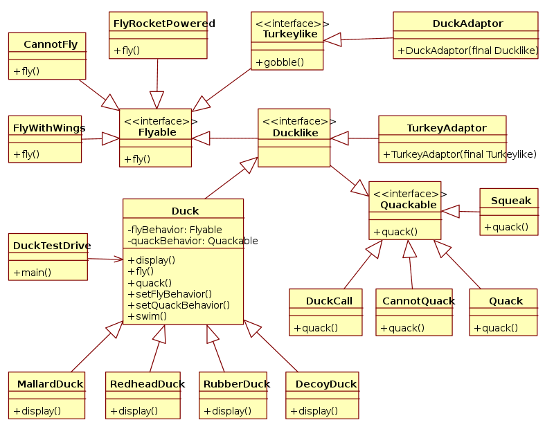
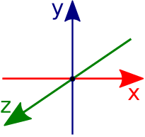
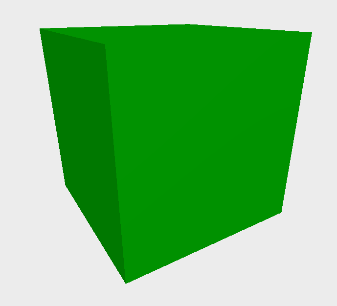
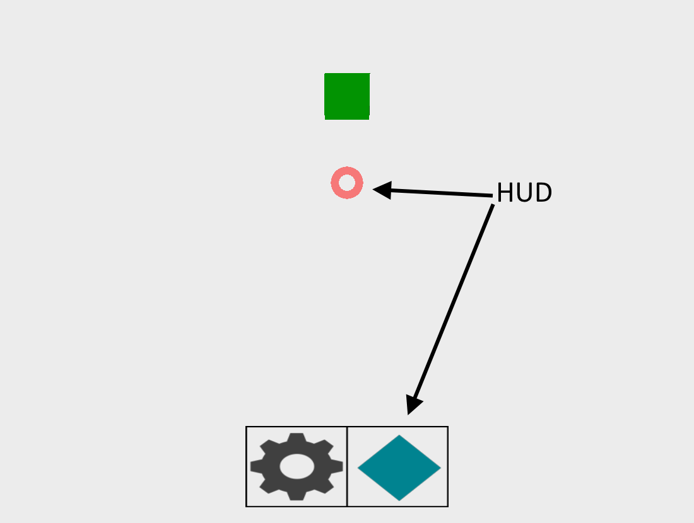
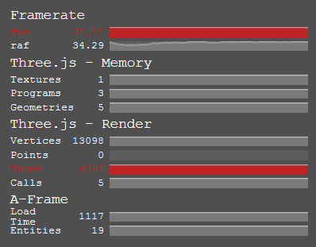

## Projekt: [MyMemorySpace](https://github.com/oxanaZh/MyMemorySpace.git)
### Über das Projekt

## Dokumentation: A-FRAME

<figure id="imgCompOverInher">
  
</figure>

## Inhaltsverzeichnis
1. Was ist VirtualReality
2. Beispiele
3. A-FRAME
3.1 Was ist A-FRAME?
3.2 An wen richtet sich A-FRAME?
3.3 Wie funktioniert A-FRAME?
3.3.1 Entity-Component-System
3.3.2 A-FRAME einbinden
3.3.3 A-FRAME Konzepte
3.3.4 Asset-Management-System
3.3.5 Mixins
3.3.6 Wichtige/Nützliche Tools/Components
3.4 Ausblick

### 1. Was ist VirtualReality?

VirtualReality ist eine computergenerierte interaktive Umwelt die der Nutzer
wahrnehmen, erforschen und mit welcher er interagieren kann. Die künstliche Umwelt
wird lebendiger, je besser die Sinne des Nutzers stimuliert werden. Das Gefühl
der Immersion ist am stärksten wenn alle Sinne angesprochen werden.

Die gängige Technik der heutigen VR-Headsets sind 2 gekrümmte Linsen die einen
Bildschirm vergrößern und verzerren. Auf diese Weise erhalten die beiden Augen
unterschiedliche Bilder, das Blickfeld wird gefüllt und das Gefühl eines echten
virtuellen Raums entsteht.

Der Begriff der VR hat besonders in den letzten Jahren wieder stark zugenommen.
Durch die verbesserte Computertechnik ist VR ein interessantes Gadget für die
Entertainment-Industrie, in besonderer Hinsicht der Spieleindustrie.
Namhafte Entwickler wie HTC, Sony oder Samsung investieren in eigene Headsets und feierten
ihre Debüts vor kurzer Zeit.

Dabei können einige Headsets mittels zusätzlicher Technologie eine Person in einem
kleinen Raum orten und diese dann innerhalb von Spielen verarbeiten.

###  2. Beispiele

Headsets
* [HTC-VIVE (Valve&HTC)](https://www.vive.com/de/)
* [Sony VR (Sony)](https://www.playstation.com/de-de/explore/playstation-vr/)
* [Oculus Rift](https://www3.oculus.com/en-us/rift/)

Technologien
* [A-FRAME (Web-VR)](https://aframe.io)
* [React-VR (Web-VR)](https://developer.oculus.com/blog/introducing-the-react-vr-pre-release/)
* [Carmel-VR (Web-Browser spezialisiert auf VR)](https://developer.oculus.com/blog/carmel-developer-preview-launches-today/)

Entertainment
* [Chernobyl-VR (Chernobyl über VR besuchen)](http://www.chernobylvrproject.com/en/)
* [Project Arena (VR-Sport Tennis-Spiel)](https://www.youtube.com/watch?v=SIfGuPW_mMs)
* [Public Speaking (VR Reden üben)](https://play.google.com/store/apps/details?id=com.virtualSpeech.android)

### 3. A-FRAME

#### 3.1 Was ist A-FRAME?

[A-Frame](https://aframe.io/) ist ein Web Framework um die Virtual Reality in den Webbrowser zu bringen. Es werden Desktop und mobile Plattformen unterstützt sowie VR-Brillen. A-Frame nutzt dafür HTML sowie das Entity-Component-System.

Durch das Entity-Component-System können Entities einfach eingefügt und in ihrem Verhalten und Aussehen verändert werden. Diese können um Components erweitert werden, was zusätzliche Funktionalitäten ermöglicht. Dadurch können Entities viele verschiedene Eigenschaften besitzen die von anderen Components beigesteuert werden.

A-Frame ist aktuell in der Version 0.4.0 verfügbar und wird durch die Community stetig erweitert und gefördert.

A-Frame Code Beispiel:
```html
<body>
  <a-scene>
    <a-box color="#6173F4" opacity="0.8" depth="2"></a-box>
    <a-sphere radius="2" src="texture.png" position="1 1 0"></a-sphere>
  </a-scene>
</body>
```
_Hinweis: Hier wird A-Frame in der Version 0.3.0 betrachtet_

#### 3.2 An wen richtet sich A-FRAME?

A-Frame wird vom Mozilla-VR-Team entwickelt und richtet sich an die Web-Entwickler die mit dem Framework VR ins Web bringen sollen. Die sogenannten A-Frame Scenes können mittels DOM interaktiv manipuliert werden und funktionieren folglich wie bekannte Technologien der Web-Entwickler.

#### 3.3 Wie funktioniert A-FRAME?

A-Frame basiert auf [THREE.js](https://threejs.org/). Einer Cross-Browser Javascript API mit der man 3D Grafiken/Animationen
im Web Browser visualisieren kann. THREE.js basiert dabei auf [WebGL](https://www.khronos.org/webgl/).

A-Frame erweitert THREE.js um das auf HTML basierende Entity-Component-System. Somit können Szenerien einfacher und schneller visualisiert und verwaltet werden. Zusätzlich wird das Entity-Component-System
leicht über DOM nutzbar ([s. 3.3.1]).
##### 3.3.1 Entity-Component-System

Das [Entity-Component-System Design-Pattern](https://en.wikipedia.org/wiki/Entity%E2%80%93component%E2%80%93system)(ECS-Pattern) wird häufig in der Spieleentwicklung genutzt. Durch das Pattern wird eine hohe Flexbilität ermöglicht. Jedes existierende Objekt in der (Spiel-)Welt ist ein Entity. Ihr Verhalten wird durch die Components bestimmt. Dabei kann ein Entity beliebige viele Components halten und so in seinem Verhalten und Aktionen definiert werden. Dies ermöglicht Änderungen des Verhaltens des Objekts **während der Laufzeit**, indem man Components entfernt oder neue Components hinzufügt (ähnlich wie bei Strategie Pattern).

Durch das Nutzen des Patterns entfällt die strikte hierarchische Struktur der Vererbung, die komplexer wird, je mehr Verhaltensmuster eingefügt werden müssten.

Folglich basiert das ECS-Pattern sehr stark auf dem "Composition over Inheritance" Prinzip.

Das ["Composition over Inheritance"](https://en.wikipedia.org/wiki/Composition_over_inheritance) Prinzip ist ein Prinzip aus der OOP. Ziel ist es, Klassen ein Polymorphisches Verhalten, mit Code Wiederverwendung, beizubringen indem Klassen in ihrem Verhalten durch Objekte definiert werden die sie von anderen Klassen erzeugen und beinhalten/tragen (Composition). Diese Objekte bestimmen dann das Verhalten.
Die ungewünschte Alternative wäre es, das Verhalten durch Vererbung zu definieren (Inheritance).

Composition over Inheritance Beispiel:

<figure id="imgCompOverInher">
  
</figure>


Der Vorteil ist also dass wenn wir ein Entity um Verhalten erweitern möchten, wir nicht eine weitere Vererbungshierarchie hinzufügen müssen. Ebenso können leicht Verhaltensmuster erzeugt werden, die dann von allen Entitites benutzt werden können.

##### 3.3.2 A-Frame einbinden

A-Frame kann über die folgenden Wege initialisiert und in das eigene Projekt eingebunden werden.

- **Variante 1:** Das JS-Script in der Minified-Version in seine HTML-Page einbetten: `<script src="https://aframe.io/releases/0.3.2/aframe.min.js"> </script>`
- Optional kann man das Script auch runterladen. Die offizielle Version kann hier
gefunden werden: [A-FRAME 0.3.2 min](https://aframe.io/releases/0.3.2/aframe.min.js)

- **Variante 2:** Über NPM. `npm install --save aframe`

Stable Versions sind somit unter folgendem Link zu finden [A-FRAME npm](https://www.npmjs.com/package/aframe)

Im Source Code nun das Modul einbinden.

`require('aframe');`


A-FRAME ist nun initialisiert.

##### 3.3.3 A-Frame Konzepte

###### **Szene**

<figure id="imgCompOverInher">
  
</figure>

A-FRAME Objekte werden erst sichtbar wenn sie einer Szene inneliegen.

```html
<a-scene></a-scene>
```

Innerhalb dieser Szene können nun Objekte eingefügt werden. Die VR ist ein
klassischer 3D-Raum in dem ihr über die X,Y,Z Koordinaten Objekte einfügen könnt.

Das Koordinatensystem in A-Frame sieht folglich so aus:
<figure id="imgCompOverInher">
  
</figure>

Die Distanz wird in Meter berechnet.

Die Szene bildet dabei ein eigenes Entity ab. Anschließend kann die Scene über Attribute manipuliert werden. Außerdem können weitere Entities zu der Szene hinzugefügt werden.

Die A-Frame Szene bringt grundlegende Interaktionsmöglichkeiten mit:
- _WASD Tasten_ um sich in der Szene fortzubewegen
- _Linke-Maustaste Klick_ und _Ziehen_ um sich umzuschauen
- umschauen mit VR-Brille

Mehr zur [A-Scene](https://aframe.io/docs/0.3.0/core/scene.html)

###### **A-Frame Entities**

In A-Frame werden alle Entities als HTML-Tags <a-entity> representiert. Ein Entity stellt ein Platzhalter-Objekt dar, dem wir
bestimmtes Verhalten, Aussehen und Funktionalität zuweisen können.

 Ein einfaches Entity kann man mit dem Tag `<a-entity>` der Szene hinzugefügt werden, diese besitzt noch keine Erscheinung, Verhalten und Funktionalität. Jedes A-Frame Entity hält automatisch die Komponenten _position_, _rotation_, und _scale_.

 Beispiel:

 ```html
 <a-entity id="mario"></a-entity>
 ```

Um die Eigenschaften und Methoden eines Entities zu lesen muss man nur mittels DOM-Parser das HTML-Element aufrufen.

```javascript
var el = document.querySelector('#mario');
```
<hr>
[Mehr über A-Frame Entities](https://aframe.io/docs/0.3.0/core/entity.html).

A-Frame bietet einige vordefinierte Entities(Primitives) an.
Primitives haben einen vordefinierten Namen und verfügen bereits über einige Komponenten
mit default Werten.
Einige Beispiele:
- `<a-box>`
- `<a-circle>`
- `<a-plane>`
- `<a-sphere>`
- `<a-camera>`
- `<a-cursor>`
- `<a-image>`
- `<a-sound>`
- `<a-video>`

Mehr [Primitives](https://aframe.io/docs/0.3.0/primitives/).
Außerdem gibt es die Möglichkeit ein Entity selbst zu definieren.

**Beispiel:**

Fügen wir nun ein Entity ein um die Szene nicht leer zu lassen.

```html
<a-scene>
  <a-box></a-box>
</a-scene>
```

Eine Box ist wie der Name schon angibt ein 3D Rechteck. Es ist ein Entity das den Ursprungs-Entity in seiner Geometrie bereits beschreibt (`geometry="primitive: box;`).

###### **A-Frame Components**

Components sind wiederverwendbare Objekte die einem Entity hinzugefügt werden und diesem dann ihr Verhalten/ihre Eigenschaften hinzufügen. Aus vielen kleinen Components kann so eine komplexe Entität erzeugt werden.

<figure id="imgComponents">
  
</figure>

**Attribute:**
Um einem Entity Eigenschaften zu verleihen, fügt man Komponenten hinzu.
Dies kann man mittels HTML-Attributen tun.
Beispielsweise fügen wir Attribute `width, height, depth` der Box hinzu, die Breite (x-Achse), Höhe(y-Achse), Tiefe(z-Achse) angeben.

```html
<a-scene>
  <a-box color="#6173F4" width="4" height="10" depth="2"></a-box>
</a-scene>
```
Mit Javascript kann man die Komponente dynamisch einbinden. Farbe, Form, Sichtbarkeit, je nachdem
welche Funktionen man von A-FRAME selber oder Fremd-Plugins nutzen möchte.

 `<a-entity>.components` ist ein Objekt aus Components dass dem Entity anhängt.
Damit kann auf alle Components eines Entities zugegriffen werden (Eigenschaften, Methoden).

Nutzung:
```javascript
//Material-Object aulesen
var material = document.querySelector('a-entity[material]').components.material.material;
```

```javascript
// Methode des Component-Sound aufrufen
document.querySelector('a-entity[sound]').components.sound.pause();
```

[Mehr zu den Eigenschaften eines A-FRAME Entity](https://aframe.io/docs/0.3.0/core/entity.html#properties)

**Single-Property Component:**
Einfache Komponenten definieren nur eine Eigenschaft von einem Entity und sehen wie normale
HTML-Attribute mit einer key-value Notation aus:
```html
<a-entity position="1 2 3"></a-entity>
```
**Multi-Property Component:**
In A-Frame ist es auch möglich Komponenten zu definieren, die mehrere Eigenschaften eines Entity beeinflussen.
Solche werden in CSS-Inline ähnlicher Syntax dargestellt:
```html
<a-entity light="type: point; color: crimson"></a-entity>
```
Weitere wichtige Attribute sind beispielsweise

* Position `position="3 2 5"` (x,y,z)
* Rotation `rotation="90 0 45"`(x,y,z)
* Color    `color="#FFFFFF"`
* Scale `scale="0.5 1 2"`(x,y,z)
* Geometry `geometry="primitive: box"`
* Camera `camera="userHeight: 1.6"`
* Cursor `cursor="fuse: true; fuseTimeout: 500"`
* Material `material="shader: ocean; color: blue; wave-height: 10"`
* Visibility `visible="false"`

Komponente kann man beliebig in einem Entity kombinieren um gewünschte Effekte zu erzielen.

###### **Methoden eines Entity**
Entity verfügen über verschiedene Methoden.
Beispielsweise kann man mit Javascript Attribute eines Entity dynamisch manipulieren.

Methoden eines `Entity` (einige Beispiele)

_getAttribute(attr)_ Attribut eines Components einer Entity lesen

```javascript
// <a-entity geometry="primitive: box; width: 3">
entity.getAttribute('geometry');
// >> { primitive: "box", width: 3 }


// <a-entity data-position="0 1 1">
entity.getAttribute('data-position');
// >> "0 1 1"
```

_setAttribute(attr)_ : Component einer Entity zuweisen
```javascript
entity.setAttribute('visible', false);
```
_removeAttribute(attr)_ Component entfernen
```javascript
entity.removeAttribute('sound');
```
<hr>

###### **Event-Listener eines Entity**

Entities können über einen Eventlistener auf Änderungen ihrer Components reagieren.

```javascript
entity.addEventListener('componentchanged', function (evt) {
  if (evt.detail.name === 'position') {
    console.log('Entity has moved from', evt.detail.oldData, 'to', evt.detail.newData, '!');
  }
});
```

Ebenfalls kann auf neu angehängte Entities reagiert werden.

```javascript
entity.addEventListener('child-attached', function (evt) {
  if (evt.detail.el.tagName.toLowerCase() === 'a-box') {
    console.log('a box element has been attached');
  };
});
```
###### **Animation**
A-Frame erlaubt Entities zu animieren.
Zum Beispiel können wir die Box animieren, beispielsweise in der Farbe.

```html
<a-box width="4" height="10" depth="2">
  <a-animation attribute="material.color" from="white" to="red" dur="1000"></a-animation>
</a-box>
```

Die Box erhält als Child ein Entity dass vom A-FRAME Typ `animation` ist. Mittels `animation` lassen sich Entities in ihrem Verhalten animieren.

Die Animationen sind nützlich für vordefinierte Szenerien bei denen mehr Bewegung in die Szene kommen soll.

Mehr zu [Animationen](https://aframe.io/docs/0.3.0/core/animations.html)

###### **Licht**
Als nächstes kann die Szene beleuchtet werden. Eine Szene ist zu Beginn immer beleuchtet, nach hinzufügen von Lichtern werden die Start-Lichter jedoch entfernt.

Lichter lassen sich wie normale Entities hinzufügen.

```html
<a-light type="point" color="#AAA" position="0 5 0"></a-light>
```

Dabei hält ein Licht je nach Typ verschiedene Attribute. Je nach Typ können oder
können nicht Position, Richtung, Intensität, Farbe, usw. übergeben werden.

Der Typ legt folglich die Art des Lichtes fest.

Es gibt folgende Typen:

* Ambient
  - wirken global
  - besitzen keine Positions, Rotations und Skalierungswerte
  - sind unverzichtbar da ohne Ambient Light die Szene schnell zu dunkel wird
* Directional (wie: Sonne)
* Hemisphere
  - wie *Ambient* aber mit 2 Farben
  - Licht von oben und unten
* Point (wie: Glühbirne)
* Spot (wie: Scheinwerfer)
  - werfen Licht in eine Richtung

Mehr zu [Licht](https://aframe.io/docs/0.3.0/components/light.html)

###### **Himmel**

```html
<a-sky color="#73F7DD"></a-sky>
```

Über den Asset-Manager können Bilder geladen werden(s. 3.3.4).

```html
<a-sky src="Asset-ID"></a-sky>
```

Als letztes fügen wir einen Himmel unserer Szene hinzu. Bei der Auswahl des Bildes sollte darauf geachtet werden, dass das Bild über die gesamte Szene gespannt wird. Es wird also wie um eine Kugel gewickelt. Folglich sind Bilder mit schwarzen Rändern, in niedriger Auflösung, oder mit zu deutlichen Motiven unvorteilhaft da die Ränder des Bildes zu deutlich werden.

Mehr zu [Sky](https://aframe.io/docs/0.3.0/primitives/a-sky.html)

##### 3.3.4 Asset-Management-System

Das Asset-Management-System bietet die Möglichkeit Assets, also (Media-)Dateien, in einem abgegrenzten Bereich vorzuladen und im Cache zu halten. Dies ist wichtig, denn das _preloaden_ der Dateien vor dem Rendern hält die Assets in einem Cache, verhindert das Fehlen von Assets in der Szene und verbessert die Performance.

Assets werden innerhalb der Scene im `<a-assets></a-assets>` Block geladen. Die Scene wird erst gerendert wenn alle Assets erfolgreich geladen wurden oder einen Fehler beim Laden erzeugt haben.

Folgende Assets HTML-Elemente werden für A-FRAME definiert:

* `<a-asset-item>` - Gemischtes. z.B. 3D-Objekte
* `<audio>` - Audio Dateien
* `` - Bilder (Texturen)
* `<video>` - Video (Texturen)
* `<a-mixin>` - s. 3.3.5

Diese Assets können dann innerhalb der Entities benutzt werden.

```html
<a-scene>
  <!-- Asset management system. -->
  <a-assets>
    <a-asset-item id="sculpture" src="./assets/objects/cube/sculpture.dae"></a-asset-item>
    <a-mixin id="image" geometry="height: 2; width: 2"></a-mixin>
    <audio id="blip1" src="blipaudio.wav"></audio>
    
    <video id="kentucky-derby" src="derby.mp4">
  </a-assets>
  <!-- Scene. -->
  <a-plane src="advertisement"></a-plane>
  <a-sound src="#blip1"></a-sound>
  <a-entity geometry="primitive: plane" material="src: #kentucky-derby"></a-entity>
  <a-collada-model click-drag src="#sculpture" position="10 0 -6"></a-collada-model>
</a-scene>
```

##### 3.3.5 Mixins

Mixins bieten die Möglichkeit mehrere Components zusammenzufassen und wiederzuverwenden (Sammelbecken von Components). Sie werden im Asset-Management-System über das `<a-mixin></a-mixin>` Element eingebunden. Entities die das Mixin einbinden enthalten folglich die Eigenschaften der Mixin-Components.

```html
<a-scene>
  <a-assets>
    <a-mixin id="red" material="color: red"></a-mixin>
    <a-mixin id="blue" material="color: blue"></a-mixin>
    <a-mixin id="cube" geometry="primitive: box"></a-mixin>
  </a-assets>
  <a-entity mixin="red cube"></a-entity>
  <a-entity mixin="blue cube"></a-entity>
</a-scene>
```

Das 1. Entity überinmmt die Eigenschaften von `red` und `cube`, in dieser Reihenfolge.

Das 2. Entity würde sich ohne Mixin wie folgt schreiben.

```html
<a-entity material="color: blue" geometry="primitive: box"></a-entity>
```

Eigenschaften eines Multi-Property (z.B. ` geometry="primitive: box; width: 1; height: 1; depth: 1"`) mischen sich wenn sie von mehreren Mixins und/oder mit dem Entity definiert werden.

```html
<a-scene>
  <a-assets>
    <a-mixin id="box" geometry="primitive: box"></a-mixin>
    <a-mixin id="tall" geometry="height: 10"></a-mixin>
    <a-mixin id="wide" geometry="width: 10"></a-mixin>
  </a-assets>
  <a-entity mixin="wide tall box" geometry="depth: 2"></a-entity>
</a-scene>
```

Das Entity bindet hier alle Mixins ein und definiert seine eigene Tiefe ( _depth_ ). Zusammengesetzt sieht das Entity wie folgt aus:

```html
<a-entity geometry="primitive: box; height: 10; depth: 2; width: 10"></a-entity>
```

Die Ordnung der eingebundenen Mixins spielt eine Rolle wenn die Mixins die selben Component Eigenschaften definieren.

```html
<a-scene>
  <a-assets>
    <a-mixin id="red" material="color: red"></a-mixin>
    <a-mixin id="blue" material="color: blue"></a-mixin>
    <a-mixin id="cube" geometry="primitive: box"></a-mixin>
  </a-assets>
  <a-entity mixin="red blue cube" material="color: green"></a-entity>
</a-scene>
```

1. In diesem Beispiel wird zunächst das Mixin `red` eingebunden. Im ersten Schritt ist also die Farbe des Entities rot.

2. Das Mixin `blue` wird eingebunden. Die Component `material` Eigenschaft `color` wird mit blau überschrieben.

3. Das Mixin `cube` wird eingebunden. Das Entity übernimmt die Geometry Eigenschaft.

4. Das Entity bindet das `material` Component ein mit dem Attribut `color: green`. Die alte Farbe wird also mit grün überschrieben.

Das Resultat ist ein grüner Würfel.

<figure id="imgGreenCube">
  
</figure>

Die Reihenfolge der eingebunden Mixins spielt also eine tragende wenn Eigenschaften wiederholt definiert werden.

Reihenfolge

`mixin="1.eingebunden 2.eingebunden 3.eingebunden"` => 4.Entity Eigenschaften eingebunden

##### 3.3.6 Wichtige/Nützliche Tools/Components

**Tools**

Zur Einführung in die Modellierung von Objekten und dessen Einbindung in A-FRAME hat A-FRAME [MagicaVoxel in A-FRAME](https://aframe.io/docs/0.3.0/guides/building-with-magicavoxel.html) als kleines Tutorial verfasst.

Der [A-FRAME Inspector](https://aframe.io/docs/0.3.0/guides/using-the-aframe-inspector.html) erlaubt es eine Szene zu untersuchen und zu manipulieren.

<figure id="imgInspector">
  
</figure>


**Components (Auszug)**

Elementar und bereits genannt:

* [Geometry](https://aframe.io/docs/0.3.0/components/geometry.html)
* [Light](https://aframe.io/docs/0.3.0/components/light.html)
* [Material](https://aframe.io/docs/0.3.0/components/material.html)
* [Position](https://aframe.io/docs/0.3.0/components/position.html)
* [Rotation](https://aframe.io/docs/0.3.0/components/rotation.html)

[Camera](https://aframe.io/docs/0.3.0/components/camera.html) beschreibt die Kamera die im A-FRAME Fenster eingebunden wird. Bindet man an diese ein Entity kann ein HUD simuliert werden.

<figure id="imgHUD">
  
</figure>

```html
<a-camera>
  <a-ring radius-inner="0.02" radius-outer="0.04" position="0 0 -1"
            material="color: red; opacity: 0.5"></a-ring>
	<a-image src="#pic" position="0 -0.7 -1" width="0.5" height="0.2" depth="0.1">
</a-camera>
```

[Cursor](https://aframe.io/docs/0.3.0/components/cursor.html) erlaubt Interaktion mit Entities über klicken und betrachten.

[Stats](https://aframe.io/docs/0.3.0/components/stats.html) zeigt technische Daten an.

<figure id="imgStats">
  
</figure>

```html
<a-scene stats></a-scene>
```

[Visible](https://aframe.io/docs/0.3.0/components/visible.html) definiert die Sichtbarkeit.

##### 3.4 Ausblick

A-FRAME ist am 16.12.16 auf Version 0.4.0 geupdated worden. A-FRAME zielt weiterhin darauf ab 'Community-Driven'
 zu bleiben.


 <figure id="imgCompOverInher">
   
 </figure>
