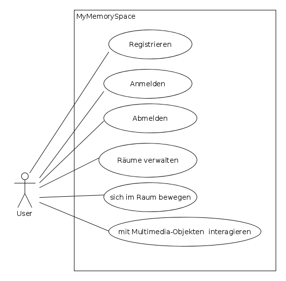
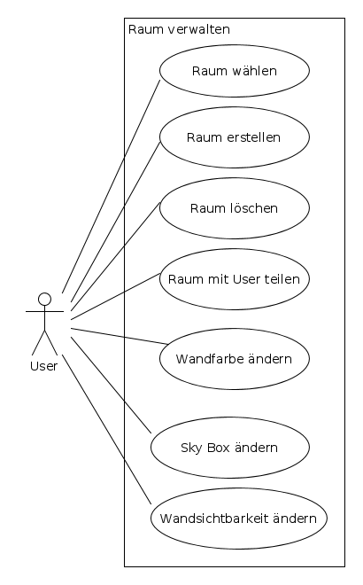
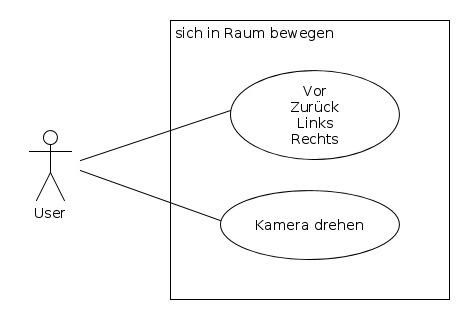
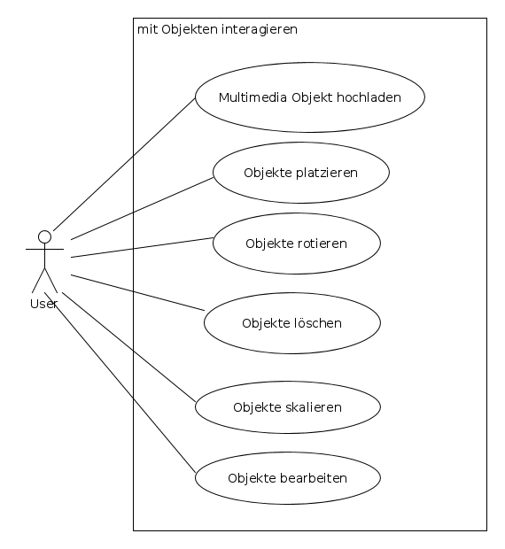

## 1 Zielbestimmung
### 1.1 Musskriterien

Das System muss dem Nutzer die Möglichkeit geben einen virtuellen Raum zu verwalten.
Der Nutzer muss nach der Anmeldung einen virtuellen Raum erhalten den er frei nach seinen
Wünschen modellieren kann.

Das System muss die Einbindung von:
- Objekten/Models
- Videos
- Audiodateien
- Bildern
- Texten

ermöglichen.
Diese müssen vom System geschützt vor Dritten gespeichert und verwaltet werden.
Dem Nutzer ist es möglich sich im virtuellen Raum zu bewegen, mit einer VR-Brille oder ohne.

Das System ermöglicht es dem Nutzer die bereits genannten Media-Files hochzuladen und im Raum zu
bearbeiten, nämlich:
- Rotieren
- Skalieren
- Platzieren

Diese Positionen müssen vom System gespeichert werden.
Das System muss deutlich machen ob mit einem Objekt interagiert werden kann.
Das System muss diese Interaktionen einfach vermitteln.
Das System muss mehreren Nutzern einen Austausch der Räume ermöglichen. Dabei können Nutzer
ihre Räume gegenseitig kenntlich machen und den anderen Raum laden und betreten.

### 1.2 Abgrenzungskriterien
Keine soziale Plattform. User können sich gegenseitig nicht sehen wie auf Chatplattformen. Ein
Austausch erfolgt über ein kurzes einfaches Interface.
Der primäre Fokus liegt auf dem virtuellen Raum und seiner Gestaltung und Interaktivität.

## 2 Produkteinsatz
### 2.1 Anwendungsbereiche
Das Produkt wird im privaten Bereich angewendet.
### 2.2 Zielgruppen
Zielgruppe sind vornehmlich Schüler, Studenten etc. alle Personen die ein interaktives Lernen
bevorzugen bzw. ausprobieren möchten.
### 2.3 Betriebsbedingungen
Das Produkt wird über das Internet angeboten. Dahinter verbirgt sich eine Client-Server Architektur.

## 3. Produktübersicht
### 3.1 UseCase: MyMemorySpace
<figure id="imgUCmms">
  
</figure>

### 3.1.1 SubUseCase: Raum verwalten
<figure id="imgUCprofverw">
  
</figure>

### 3.1.2 SubUseCase: Sich in Raum bewegen
<figure id="imgUCbewegen">
  
</figure>

### 3.1.3 SubUseCase: Mit Objekten interagieren
<figure id="imgUCinteract">
  
</figure>

## 3.2 Use-Case Tabellen

### UC-1 Registrieren
| Use Case ID: | UC-1 |
| --| --|
| Title: | User Registrieren |
| Description: | User registriert sich (neuer User) um Plattform zu nutzen |
| Trigger | Registrieren Button |
| Primary Actor | User |
| Preconditions | - |
| Postconditions | User ist registriert und kann sich anmelden |
| Other Use Cases | - |
| Main   Success Scenario: | 1. User klickt auf Registrieren   2. System zeigt Registrierungsfenster   3. User gibt Usernamen an   4. User gibt Passwort an   5. System prüft ob alle Felder richtig ausgefüllt sind   6. System blendet den Button "Registrieren" ein   7. User klickt auf Bestätigen   8. System registriert neuen User |
| Extensions | 3a. User gibt ungültigen Namen ein   - 3a.1 System zeigt Fehlermeldung "Name in ungültigen Format eingegeben"   3b. Kein Name eingegeben   - 3b.1 System zeigt  Fehlermeldung "kein Name eingegeben"   3c. Name existiert bereits   - 3c.1 System zeigt Fehlermeldung: "diese Username existiert bereits. Wählen Sie einen anderen Usernamen aus."   4a. Ungültiges Passwort Format   - 4a.1 System zeigt Fehlermeldung: "ungültiges Passwort Format"   4b. Kein Passwort eingegeben   - 4b.1 System zeigt Fehlermeldung: "kein Passwort eingegeben"  7a nicht alle Felder sind richtig ausgefüllt   - 7a.1 System zeigt Fehlermeldung: "Füllen Sie alle Felder aus"   - 7a.2 User kann versuchen die Registrierung nochmal durchzuführen(Schritt 3 -7 ) |
| Owner | Oxana Zh / Karsten T |
| Priority | High |
### UC-2 Anmelden
| Use Case ID: | UC-2 |
| --| --|
| Title: | User Anmeldung/Login |
| Description: | User meldet sich auf der Plattform an um sie zu nutzen |
| Trigger |User klickt auf Login Button |
| Primary Actor | User |
| Preconditions | User ist auf der Plattform bereits registriert |
| Postconditions | User ist unter seinem Namen in System angemeldet |
| Other Use Cases | UC-1 |
| Main   Success Scenario: |  1. System zeigt Anmeldefenster    2. User gibt Usernamen ein     3. User gibt Passwort ein     4. User klickt auf Button "Anmelden"   5. System prüft Daten   6. System zeigt den User sein Raum |
| Extensions | 5a. angegebene Username existiert nicht   - 5a.1 System zeigt Fehlermeldung: "Username existiert nicht" und führt die Anmeldung nicht durch   - 5a.2 User kann Schritt 2 wiederholen   5b. Passwort falsch eingegeben   - 5b.1 System zeigt Fehlermeldung: "Falsches Passwort eingegeben" und führt die Anmeldung nicht durch   - 5b.2 User kann Schritt 3 wiederholen    |
| Owner | Oxana Zh / Karsten T |
| Priority | High |
### UC-3 Abmelden
| Use Case ID: | UC-3 |
| --| --|
| Title: | User Abmeldung/Logout |
| Description: | User meldet sich von der Plattform ab |
| Trigger |User klickt auf Logout Button |
| Primary Actor | User |
| Preconditions | User ist auf der Plattform bereits registriert und angemeldet |
| Postconditions | User ist nicht mehr angemeldet |
| Other Use Cases | UC-2 |
| Main   Success Scenario: |  1. System meldet den User von der Plattform ab   2. System zeigt Anmeldeform an |
| Owner | Oxana Zh / Karsten T |
| Priority | High |

### UC-4 Räume verwalten
| Use Case ID: | UC-4 |
| --| --|
| Title: | Räume verwalten |
| Description: | User Verwaltet seine VR Räume |
| Trigger | User wählt in Hauptmenü den Punkt "Meine Räume" aus |
| Primary Actor | User |
| Preconditions | User ist auf der Plattform bereits registriert und angemeldet |
| Postconditions | User kann ihm zur Verfügung stehende Räume verwalten |
| Other Use Cases | UC-2 |
| Main   Success Scenario: |  1. System zeigt Menüpunkte zum verwalten der Räume an:    - a Raum wählen   - b Raum erstellen   - c Raum löschen   - d Raum mit User teilen   - e Wandfarbe ändern   - f Sky Box ändern   - g Wandsichtbarkeit ändern |
| Owner | Oxana Zh / Karsten T |
| Priority | High |

#### UC-4.1 Raum wählen
| Use Case ID: | UC-4.1 |
| --| --|
| Title: | Raum wählen |
| Description: | User wählt und wechselt den Raum |
| Trigger | User wählt Menü "Raum wechseln" |
| Primary Actor | User |
| Preconditions | User hat menü "Meine Räume" geöffnet |
| Postconditions | User hat Raum gewechselt |
| Other Use Cases | UC-4 |
| Main   Success Scenario: |  1. System zeigt zur Verfügung stehende Räume   2. User wählt Raum aus Dropdown-Menü   3. System lädt den gewählten Raum |
| Owner | Oxana Zh / Karsten T |
| Priority | High |

#### UC-4.2 Raum erstellen
| Use Case ID: | UC-4.2 |
| --| --|
| Title: | Raum erstellen |
| Description: | User erstellt Raum mit einem Namen |
| Trigger | User wählt Menü "Raum erstellen" |
| Primary Actor | User |
| Preconditions | User hat Menü "Meine Räume" geöffnet |
| Postconditions | User hat einen neuen Raum erstellt |
| Other Use Cases | UC-4 |
| Main   Success Scenario: |  1. System zeigt Menü zum Raum erstellen an   2. User gibt Namen für den neuen Raum an   3. User drückt auf "OK"   4. System erstellt neuen Raum |
| Extensions | 3a. Ungültiger Raum Name   - 3a.1 System zeigt "Ungültiger Raum Name an"  und erstellt den Raum nicht   - 3a.2 User kann 2. wiederholen   3b. Leerer Raum Name   - 3b.1 System zeigt "Leerer Name unzulässig" an und erstellt den Raum nicht   - 3b.2 User kann 2. wiederholen   3c. Doppelter Raum Name   - 3c.1 System zeigt "Raum Name existiert bereits" an und erstellt den Raum nicht   - 3c.2 User kann 2. wiederholen  |
| Owner | Oxana Zh / Karsten T |
| Priority | High |

#### UC-4.3 Raum löschen
| Use Case ID: | UC-4.3 |
| --| --|
| Title: | Raum löschen |
| Description: | User wählt Raum und löscht den Raum |
| Trigger | User wählt Menü "Raum löschen" |
| Primary Actor | User |
| Preconditions | User hat Menü "Meine Räume" geöffnet |
| Postconditions | User hat Raum gelöscht |
| Other Use Cases | UC-4 |
| Main   Success Scenario: |  1. System zeigt zur Verfügung stehende Räume   2. User wählt Raum aus Dropdown-Menü   3. User drückt auf "Löschen"   4. System zeigt bestätigungs button   5. User bestätigt seine Aktion   6. System löscht ausgewählten Raum |
| Extensions | 3a. User wählt aktuellen Raum   - 3a.1 System zeigt "Aktueller Raum kann nicht gelöscht werden"   - 3a.2 User kann 2. wiederholen |
| Owner | Oxana Zh / Karsten T |
| Priority | High |

#### UC-4.4 Raum mit User teilen
| Use Case ID: | UC-4.4 |
| --| --|
| Title: | Raum mit User teilen |
| Description: | User gibt seinen Raum anderen Usern frei |
| Trigger | "Teilen"-Button |
| Primary Actor | User |
| Preconditions | User hat Menü "Meine Räume" geöffnet |
| Postconditions | Andere User können VR-Raum betreten |
| Other Use Cases | UC-4 |
| Main   Success Scenario: | 1. User klickt auf "Teilen"   2. System zeigt Namensfeld   3. User trägt Namen seines Freundes ein    4. System teilt VR-Raum mit neuem User |
| Extensions | 3a. User existiert nicht   - 3a.1 System zeigt Fehlermeldung "User existiert nicht"   3a.2 User kann Schritt 3. wiederholen  3b. User kennt Raum bereits    - 3a.1. System meldet Fehler: "User kennt VR-Raum bereits" |
| Owner | Oxana Zh / Karsten T |
| Priority | Medium |

#### UC-4.5 Wandfarbe ändern
| Use Case ID: | UC-4.5 |
| --| --|
| Title: | Wandfarbe ändern |
| Description: | User ändert Farbe der Wände in aktuellem Raum |
| Trigger | Wählt eine Wand im Menü |
| Primary Actor | User |
| Preconditions | User hat Menü "Meine Räume" geöffnet |
| Postconditions | Farbe der ausgewählte Wand wurde geändert |
| Other Use Cases | UC-4 |
| Main   Success Scenario: | 1. User wählt Wand aus Dropdown-Menü   2. User wählt Wandfarbe   3. System ändert Wandfarbe  |
| Extensions | |
| Owner | Oxana Zh / Karsten T |
| Priority | Medium |

#### UC-4.6 Sky Box ändern
| Use Case ID: | UC-4.6 |
| --| --|
| Title: | Sky Box ändern |
| Description: | User ändert Sky Box |
| Trigger | User wählt neue SkyBox |
| Primary Actor | User |
| Preconditions | User hat Menü "Meine Räume" geöffnet |
| Postconditions | Sky Box des Raumes wurde geändert |
| Other Use Cases | UC-4 |
| Main   Success Scenario: | 1. User wählt Image aus lokalem Dateisystem   2. User drückt auf "Upload"   3. System lädt Bild in Datenbank   4. System aktualisiert Sky Box |
| Extensions | 2a. Falsches Format   2a.1 System meldet "Ungültiges Format" und verwirft die neue SkyBox   2a.2 User kann 1. wiederholen   2b. Kein Bild eingehängt   2b.1 System meldet "Kein Bild gefunden"   2b.2 User kann 1. wiederholen |
| Owner | Oxana Zh / Karsten T |
| Priority | Medium |

#### UC-4.7 Wandsichtbarkeit ändern
| Use Case ID: | UC-4.7 |
| --| --|
| Title: | Wandsichtbarkeit ändern |
| Description: | User ändert Sichtbarkeit einer Wand |
| Trigger | User setzt Sichtbarkeit der Wand |
| Primary Actor | User |
| Preconditions | User hat Menü "Meine Räume" geöffnet |
| Postconditions | Sichtbarkeit der Wand wurde geändert |
| Other Use Cases | UC-4 |
| Main   Success Scenario: | 1. User wählt Wand aus Dropdown Menü   2. User wählt Wandsichtbarkeit "visible/invisible"   3. System ändert Wandsichtbarkeit |
| Extensions | |
| Owner | Oxana Zh / Karsten T |
| Priority | Medium |

### UC-5 sich in Raum bewegen
| Use Case ID: | UC-5  |
| --| --|
| Title: |  sich in Raum bewegen |
| Description: | User kann sich in dem Raum bewegen |
| Trigger | - |
| Primary Actor | User |
| Preconditions | - |
| Postconditions | User hat Position/Sicht verändert |
| Other Use Cases | - |
| Main   Success Scenario: | 1. User interagiert:   - a User bewegt sich   - b User dreht die Kamera |
| Extensions | -  |
| Owner | Oxana Zh / Karsten T |
| Priority | High |

#### UC-5.1 Vor/Zurück/Links/Rechts
| Use Case ID: | UC-5.1 |
| --| --|
| Title: | Vor/Zurück/Links/Rechts |
| Description: | User kann sich in dem Raum Vor/Zurück/Links/Rechts bewegen |
| Trigger | WASD-Keys |
| Primary Actor | User |
| Preconditions | - |
| Postconditions | User hat sich bewegt |
| Other Use Cases | UC-5 |
| Main   Success Scenario: | 1a. User bewegt sich vorwärts   1b. User bewegt sich rückwärts   1c. User bewegt sich nach links   1d. User bewegt sich nach rechts |
| Extensions | 1a-d. User läuft gegen Wand/Objekt   - 1a-d.1 System verhindert Bewegung und blockiert den User |
| Owner | Oxana Zh / Karsten T |
| Priority | High |

#### UC-5.2 Kamera drehen
| Use Case ID: | UC-5.2 |
| --| --|
| Title: | Kamera drehen |
| Description: | User kann seine Perspektive in dem Raum verändern |
| Trigger | Gedrückt gehaltene Maustaste / Sensoren der VR-Brille / Handy Sensoren |
| Primary Actor | User |
| Preconditions | - |
| Postconditions | Perspektive hat sich verändert |
| Other Use Cases | UC-5 |
| Main   Success Scenario: | 1. User hat die Kameraperspektive geändert |
| Extensions | 1a. Kamera ist blockiert   - 1a.1 System weist User darauf hin und verhindert Kamera schwenken  |
| Owner | Oxana Zh / Karsten T |
| Priority | High |

#### UC-6 mit Multimedia-Objekten interagieren
| Use Case ID: | UC-6 |
| --| --|
| Title: | mit MUltimedia-Objekten interagieren |
| Description: | User interagiert mit den Objekten im Raum |
| Trigger | - |
| Primary Actor | User |
| Preconditions | - |
| Postconditions | Raum reagiert |
| Other Use Cases | - |
| Main   Success Scenario: | 1. User hat die Möglichkeit dazu ein:   - 1a. Media-File hochzuladen    - 1b. Objekt zu platzieren   1c. Objekt zu rotieren   1d. Objekt zu löschen   1e. Objekt zu skalieren   1f. Objekt zu bearbeiten  |
| Extensions |  -  |
| Owner | Oxana Zh / Karsten T |
| Priority | High |

#### UC-6.1 Multimedia Objekt hochladen
| Use Case ID: | UC-6.1 |
| --| --|
| Title: | Multimedia Objekt hochladen |
| Description: | User lädt ein Multimedia-File hoch   Multimedia-File wird visualisiert |
| Trigger | "Hochladen" Button mit eingehängtem Media-File |
| Primary Actor | User |
| Preconditions | - |
| Postconditions | Raum visualisiert neues Multimedia-Objekt inkl. Speicherung in DB |
| Other Use Cases | UC-6 |
| Main   Success Scenario: | 1. User klickt auf "Hochladen"   2. System zeigt Upload-Fenster/Sektor   3. User hängt Media-FIle ein   4. User klickt auf "Hochladen"   5. System speichert Multimedia-FIle in DB und visualisiert neues Multimedia-FIle in dem Raum |
| Extensions |  4a. Ungültiges Format   4b. Zu große Datei   - 4a/b.1  System meldet "Ungültige Datei" verwirft Datei   4a/b2. User kann 3. wiederholen   4c. Keine Datei angehängt   4c.1 System meldet "Keine Datei gefunden"   4c.2 User kann 3. wiederholen |
| Owner | Oxana Zh / Karsten T |
| Priority | High |

#### UC-6.2 Objekt platzieren
| Use Case ID: | UC-6.2 |
| --| --|
| Title: | Objekt platzieren |
| Description: | User verschiebt ein Objekt |
| Trigger | User "zieht" Objekt in dem Raum |
| Primary Actor | User |
| Preconditions | - |
| Postconditions | Objekt ändert Position |
| Other Use Cases | UC-6 |
| Main   Success Scenario: | 1. User hält Maus auf Objekt gedrückt    2. User "zieht" Maus   3. System visualisiert die Positionsänderung |
| Extensions |  1a. Objekt ist statisch   - 1a.1 System highlighted Objekt als unpositionierbar |
| Owner | Oxana Zh / Karsten T |
| Priority | High |

#### UC-6.3 Objekt rotieren
| Use Case ID: | UC-6.3 |
| --| --|
| Title: | Objekt rotieren |
| Description: | User rotiert ein Objekt |
| Trigger | User betrachtet Objekt und drückt entsprechende Taste |
| Primary Actor | User |
| Preconditions | - |
| Postconditions | Objekt ändert Rotation |
| Other Use Cases | UC-6 |
| Main   Success Scenario: | 1. User betrachtet Objekt (Raycasting) 2. User drückt Rotationstaste 3. System rotiert Objekt entsprechend |
| Extensions |  2a. Objekt ist statisch   2a.1. System weist auf unrotierbares Objekt hin |
| Owner | Oxana Zh / Karsten T |
| Priority | High |

#### UC-6.4 Objekt löschen
| Use Case ID: | UC-6.4 |
| --| --|
| Title: | Objekt löschen |
| Description: | User löscht ein Objekt |
| Trigger | User "betrachtet" Objekt und drückt entsprechende Taste |
| Primary Actor | User |
| Preconditions | - |
| Postconditions | Objekt aus Raum und DB entfernt |
| Other Use Cases | UC-6 |
| Main   Success Scenario: | 1. User betrachtet Objekt (Raycasting) 2. User drückt Löschen-Taste 3. System löscht Objekt  |
| Extensions |  2a. Objekt ist unlöschbar   2a.1. System weist auf unlöschbares Objekt hin |
| Owner | Oxana Zh / Karsten T |
| Priority | High |

#### UC-6.5 Objekt skalieren
| Use Case ID: | UC-6.5 |
| --| --|
| Title: | Objekt skalieren |
| Description: | User skaliert ein Objekt |
| Trigger | User "betrachtet" Objekt und drückt entsprechende Taste |
| Primary Actor | User |
| Preconditions | - |
| Postconditions | Objekt skaliert groß/klein |
| Other Use Cases | UC-6 |
| Main   Success Scenario: | 1. User betrachtet Objekt (Raycasting)   2. User drückt Skaliertasten 3. System skaliert Objekt größer/kleiner |
| Extensions |  2a. Objekt ist statisch   2a.1. System weist auf unskalierbares Objekt hin |
| Owner | Oxana Zh / Karsten T |
| Priority | High |

## 4. Produktdaten
Langfristig müssen folgende Produktdaten im System gespeichert werden:
- Profil inkl. Name und Passwort
- VR Raum inkl. Seiner Objects und derer Positionen

## 5. Technische Produktumgebung
### 5.1 Software
Erfordert Web-Browser auf dem Client
### 5.2 Hardware
(optional) VR-Brille
### 5.3 Orgware
Internetanschluss

## 6. Verwendete Technologien
JavaScript, AFrame, MongoDB, HTML, CSS  

## 8. Benutzungsoberfläche
<figure id="imgUCmms">
  
</figure>
